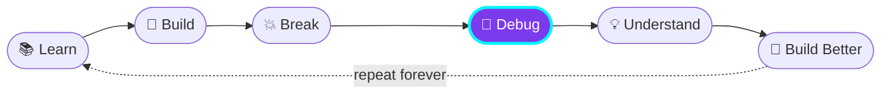

<!-- ===================== HEADER ===================== -->

 

 

<!-- ===================== ABOUT ===================== -->
## 👋 &nbsp;Hey, I'm Kundan

> **_"I don't just learn technologies — I build with them."_** 🚀

I'm a **Computer Science student at VIT-AP University** who loves turning ideas into real, working products. Right now I'm living at the intersection of

### `Full-Stack Development` &nbsp;×&nbsp; `AI` &nbsp;×&nbsp; `Cloud`

 

<!-- ===================== BUILDING ===================== -->
## ⚡ &nbsp;What I'm Building

<table align="center">
  <tr>
    <td align="center" width="25%">🌐 <b>Full-Stack Applications</b></td>
    <td align="center" width="25%">🤖 <b>AI-Powered Products</b></td>
    <td align="center" width="25%">☁️ <b>Cloud & Backend Systems</b></td>
    <td align="center" width="25%">🧠 <b>Machine Learning Projects</b></td>
  </tr>
</table>

 

<!-- ===================== TECH ===================== -->
## 🛠️ &nbsp;Tech I Work With

 

<!-- ===================== PROJECTS ===================== -->
## 🚀 &nbsp;Things I've Built

<table>
  <tr>
    <td align="center" width="33%">
      <h3>🛒 Greencart</h3>
      Full-stack grocery delivery platform
    </td>
    <td align="center" width="33%">
      <h3>🤖 QuickAI</h3>
      AI-powered SaaS platform
    </td>
    <td align="center" width="33%">
      <h3>☕ Coffee Shop</h3>
      PERN stack e-commerce application
    </td>
  </tr>
  <tr>
    <td align="center" width="33%">
      <h3>🚗 Car Rental</h3>
      Full-stack vehicle rental platform
    </td>
    <td align="center" width="33%">
      <h3>🎬 Movie Recommender</h3>
      ML-based recommendation system
    </td>
    <td align="center" width="33%">
      <h3>✨ Next up…</h3>
      Something bigger is cooking 👀
    </td>
  </tr>
</table>

 

<!-- ===================== JOURNEY ===================== -->
## 📈 &nbsp;My Developer Journey

📍 Currently at <b>Debug</b> — and honestly, having fun with it 😄

 

<!-- ===================== LEARNING ===================== -->
## 🧠 &nbsp;Currently Learning

 

<!-- ===================== GOALS ===================== -->
## 🎯 &nbsp;2026 Goals

- [ ] 🚀 Build better **production-ready** applications
- [ ] 🤖 Build useful **AI-powered** products
- [ ] ☁️ Get stronger with **cloud & backend architecture**
- [ ] 📚 Keep learning something new **every single day**
- [ ] 💡 Turn more **ideas into working products**

 

<!-- ===================== GITHUB STATS ===================== -->
## 📊 &nbsp;GitHub Stats

 

### 📈 Contribution Graph

 

<!-- ===================== SNAKE ===================== -->

### 🐍 Snake eating my contributions

<picture>
  <source media="(prefers-color-scheme: dark)" srcset="https://raw.githubusercontent.com/kundan-kumar07/kundan-kumar07/output/github-snake-dark.svg" />
  <source media="(prefers-color-scheme: light)" srcset="https://raw.githubusercontent.com/kundan-kumar07/kundan-kumar07/output/github-snake.svg" />
  
</picture>

 

<!-- ===================== CONNECT ===================== -->
## 🤝 &nbsp;Let's Connect

  

### ⭐ Thanks for visiting!

**`Keep building.`** &nbsp;•&nbsp; **`Keep learning.`** &nbsp;•&nbsp; **`Keep shipping.`** 🚀

